# Minor Web Design & Development: API

Hoi leuk dat je op mijn repo bent voor het vak API wat ik op deze minor heb gevolgd.

# Het Idee
Het schoolproject "What's Poppin'" is bedoeld om gebruikers te helpen lokale events te ontdekken. Het idee is om de Ticketmaster API te gebruiken om informatie over evenementen op te halen. Na een gesprek met de docenten bleek dat een extra API nodig is om tekstlocaties om te zetten naar coördinaten. Dit inzicht leidde tot de keuze om een kaart te integreren, waarop de evenementen grafisch worden weergegeven, waardoor het gemakkelijker wordt om te zien welke events er in de buurt plaatsvinden.

# Content Api's
Voor mijn project maak ik gebruik van verschillende content-API's:

-   **OpenStreetMap API**: Deze API zet tekstlocaties om naar coördinaten en biedt een autocomplete-functionaliteit voor de locatie-selectie, waardoor gebruikers eenvoudig een locatie kunnen kiezen.
    
-   **Leaflet API**: Deze API wordt gebruikt om een interactieve kaart weer te geven en om markers te plaatsen voor de evenementen die zich op specifieke locaties bevinden.
    
-   **Ticketmaster API**: Met deze API haal ik informatie op over evenementen die op een bepaalde dag plaatsvinden, inclusief afbeeldingen, eventdetails, venue-informatie en meer.
# Web Api's
Voor de web-functionaliteiten maak ik gebruik van de volgende API's:

-   **Geolocation API**: Hiermee haal ik de locatie van de gebruiker op en sla ik deze op in het systeem, zodat ik gerichte informatie kan geven.
    
-   **LocalStorage API**: Deze API slaat de locatie van de gebruiker op, zodat de gegevens behouden blijven, zelfs als de gebruiker door de site navigeert.
    
-   **Battery Status API**: Met deze API controleer ik hoe vol de batterij van het apparaat van de gebruiker is. Dit is handig, vooral wanneer gebruikers video's willen maken op een feestje en niet zonder batterij willen zitten.

# Proces
Het proces van mijn project verliep in fasen. In **week 1** begon het snel met het aan de praat krijgen van de content API's afzonderlijk. In **week 2** was het me gelukt om ze met elkaar te laten communiceren. Vervolgens begon ik in **week 3** de web API's te koppelen, te beginnen met de Geolocation API, wat snel lukte. Toen ik wilde doorgaan met de Gyroscope API, ontdekte ik dat deze niet meer werkte door aanpassingen van Apple’s systeem. Dit dwong me om op zoek te gaan naar een andere web API.

In hetzelfde gesprek met Declan kwam ik erachter dat ik mijn project helemaal verkeerd had opgezet. Ik was liquid code in de client aan het gebruiken en werkte met de verkeerde programmeringstechnieken. Ik had al begonnen met de coole functionaliteiten in JavaScript, terwijl de basis in HTML nog niet goed gestructureerd was. Na een diepgaand gesprek en voorbeelden begreep ik beter hoe ik het moest aanpakken, maar ik was niet zeker of het zou lukken.

Aan het begin van **week 4**, de laatste week, had ik het gevoel dat ik op de goede weg was, maar nu moest de styling nog gebeuren en ik moest ook mijn tweede web API bedenken. De deadline kwam steeds dichterbij, en er ontstonden steeds meer problemen met mijn code. Het "kill your darlings"-principe kwam meerdere keren van pas. Maar uiteindelijk is de hoofdfunctionaliteit werkend en klaar.

# What's Poppin'
Het eindresultaat is "What's Poppin'," een webservice waarmee gebruikers kunnen ontdekken welke evenementen er in de buurt zijn van de locatie die ze invoeren. Terwijl ze typen in het zoekveld, verschijnen er suggesties voor locaties. Na het selecteren van een locatie worden de evenementen in de buurt getoond en wordt de locatie op de kaart weergegeven, samen met de evenementen. Wanneer een gebruiker op een evenement op de kaart klikt, wordt het event gemarkeerd in de lijst. Als de gebruiker op de locatie klikt, wordt de detailpagina geopend, met informatie zoals de tijd van het evenement, achtergrondinformatie, details over de locatie en een link naar de kaart. Ook worden gebruikers gewaarschuwd of hun apparaat voldoende opgeladen is – want stel je voor, je telefoon is leeg en je wilt video's maken!

# Als ik nog meer tijd had
Als ik meer tijd had, zou ik graag extra filteropties toevoegen waarmee gebruikers kunnen sorteren, zoals op afstand. Dit is iets wat ik al meet, maar waar de gebruiker nog niet mee kan spelen. Mijn idee was om een popup te laten verschijnen wanneer een gebruiker op een evenement op de kaart klikt. De code hiervoor is al geschreven, maar in de laatste fase is er iets mis gegaan waardoor de popups niet meer zichtbaar zijn. Ik zou graag willen onderzoeken waar dit fout is gegaan en het probleem oplossen. Daarnaast zou ik de detailpagina verder willen uitbreiden met meer content, aangezien ik deze informatie uit de API kan halen.

# Beeldmateriaal

  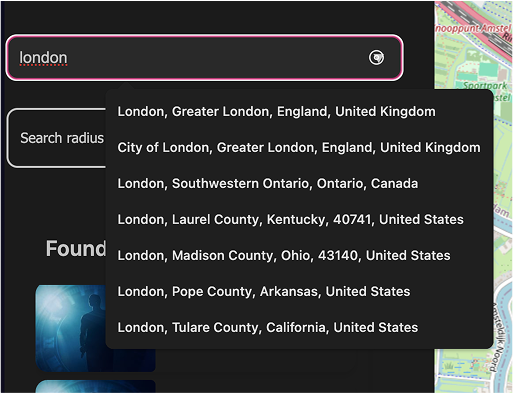
  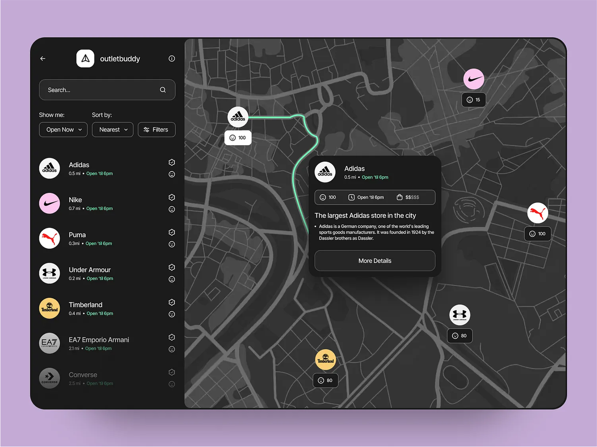
  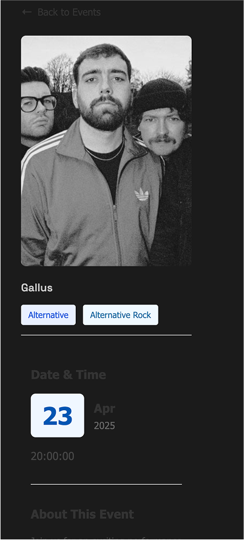
  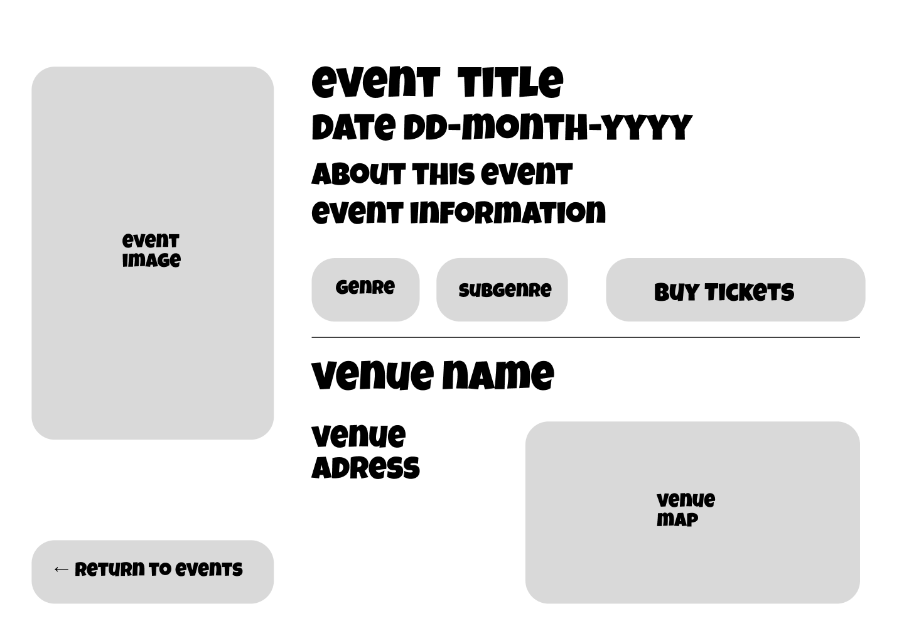
  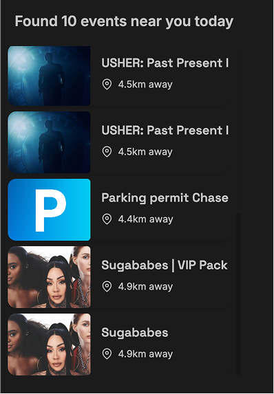
  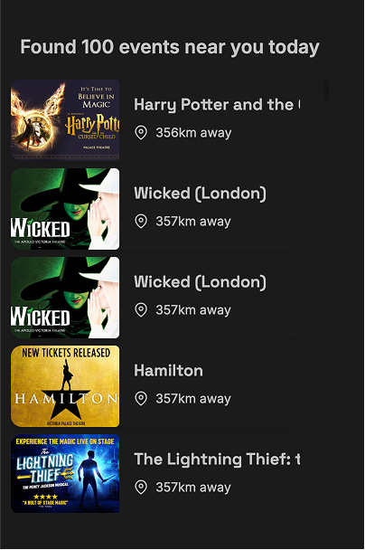
  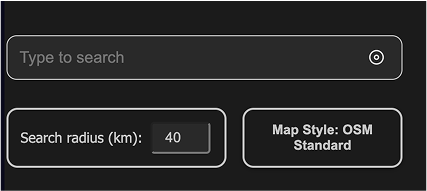
  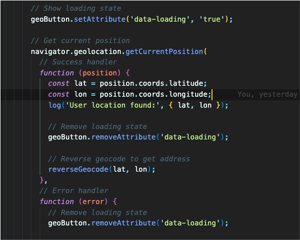
  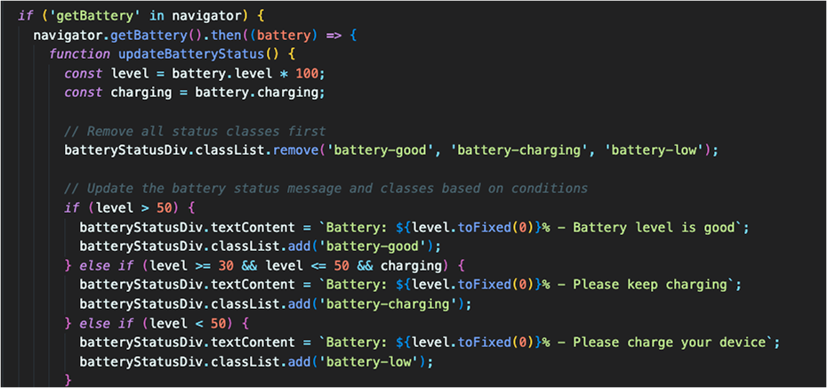
  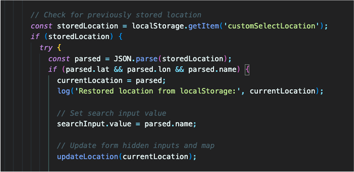
  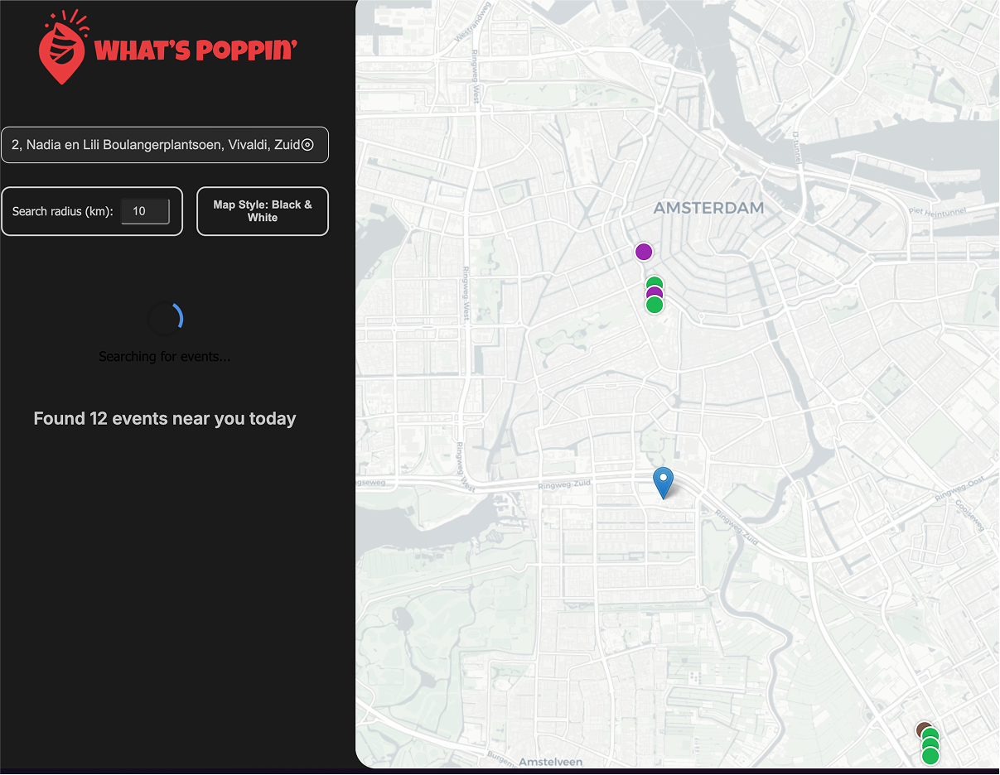
  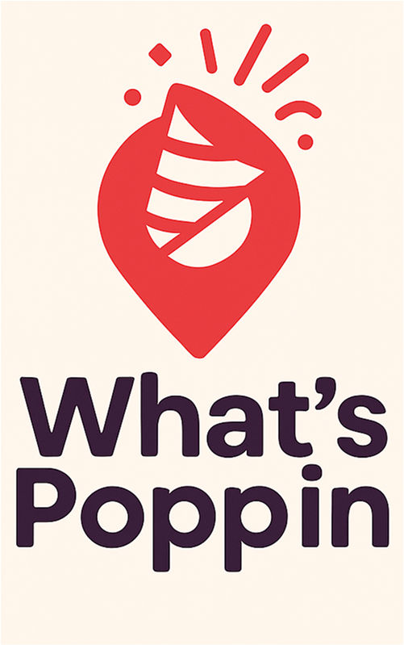
  
  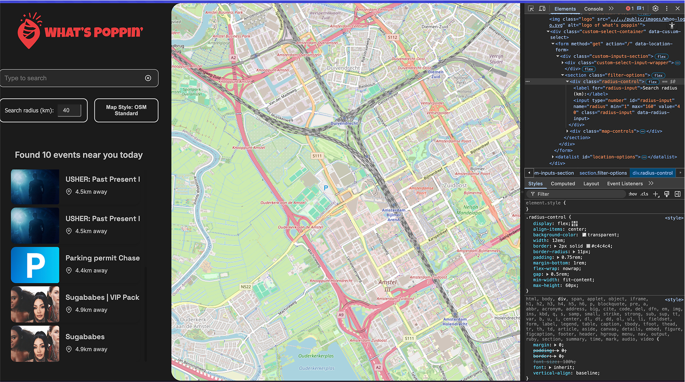
  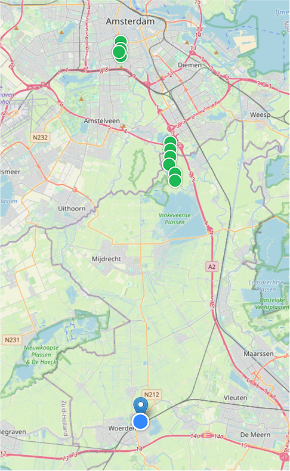
  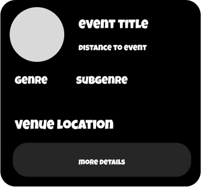
  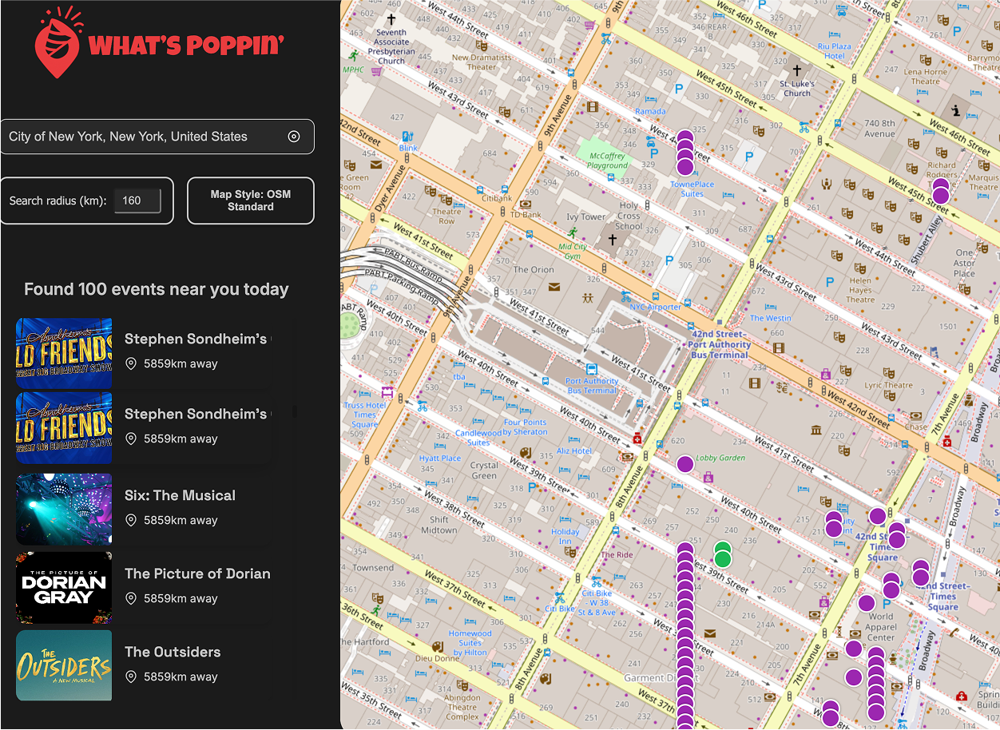
  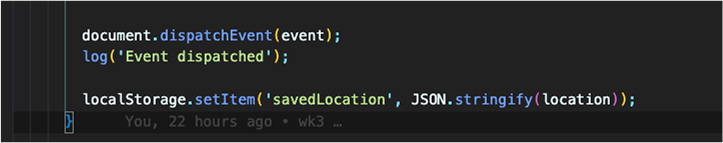

